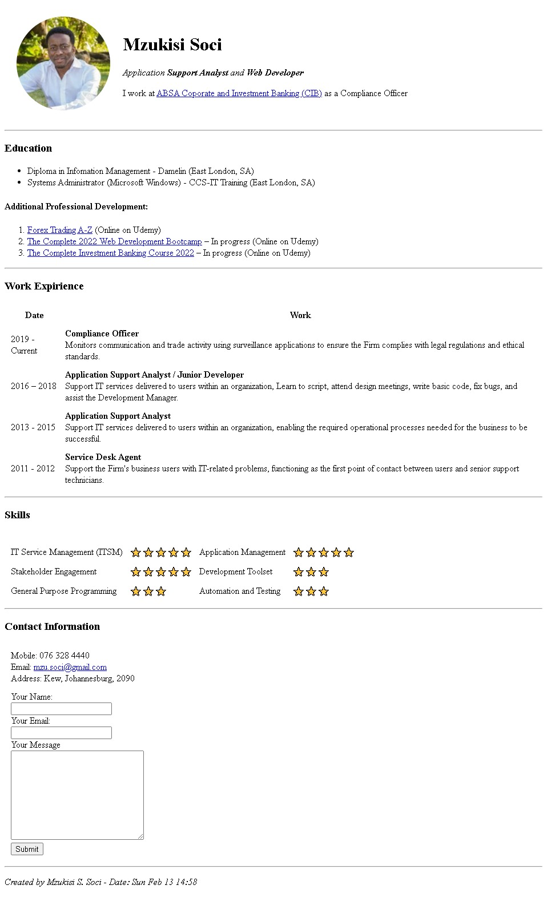

# Udemy - Intermediate HTML exercise

This is my solution to the [HTML Personal Website exercise on Udemy](https://www.udemy.com/course/the-complete-web-development-bootcamp/). The Complete 2022 Web Development Bootcamp is the tutorial I am using to learn full-stack web development.

## Table of contents

- [Overview](#overview)
  - [Screenshot](#screenshot)
  - [Links](#links)
- [My process](#my-process)
  - [Built with](#built-with)
  - [What I learned](#what-i-learned)
  - [Continued development](#continued-development)
  - [Useful resources](#useful-resources)
- [Author](#author)
- [Acknowledgments](#acknowledgments)

## Overview

This website is a html coding challenge from Udemy's 2022 Coding Bootcamp lectured by Angela Yu. This uses plain html and is to demonstrate a basic understanding of website structuring.

### Screenshot

### Links

- Solution URL: [Add solution URL here](https://your-solution-url.com)
- Live Site URL: [Add live site URL here](https://your-live-site-url.com)

## My process

I used an online app to crop my LinkedIn profile picture.
Added all text, tags, attributes and format as instructed in tutorial.
Customized content to reflect my experience.

### Built with

- Semantic HTML5 markup

### What I learned

I learned how to use Atom.io the code editor, how to use html to structure content.

Learned about the following HTML components.
HTML tags, attributes, boilerplates, lists, images, anchors, tables, forms and structure.

### Continued development

I am continuing with the course and will start learning how to use CSS to add styling to the webpage.

### Useful resources

- [MDN Web docs - HTML](https://developer.mozilla.org/en-US/docs/Web/HTML) - This has information to understand html.
- [W3Schools HTML Tutorial](https://www.w3schools.com/html/) - This has information to understand html.

## Author

- LinkedIn - [Mzukisi Soci](https://www.linkedin.com/in/mzukisi-soci-308521140/)
